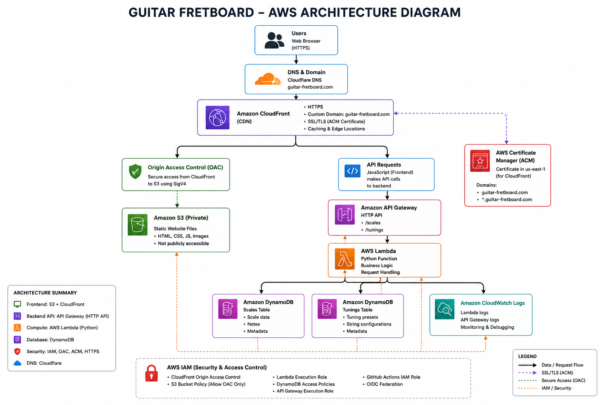
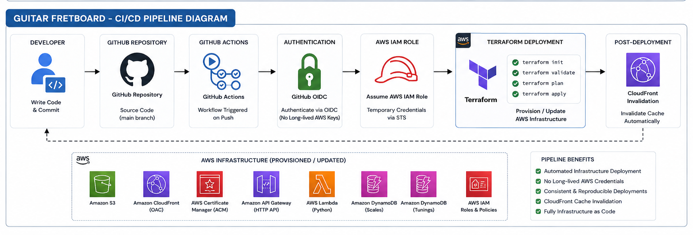

# guitar--scales-fretboard
Guitar Fretboard featuring notes, scales and visual indicators for learning. This project is to assist in solidifying my understanding of a potential team-oriented workflow, and while doing that to also learn musical and guitar scales as I am a guitar player and would like to improve myself. The project is aimed to hit two birds with one stone, mixing practical working knowledge and hobby related knowledge.

## Live Demo:

**Website:**  
https://guitar-fretboard.com/

**Source Code:**  
https://github.com/FarhanAzrayl/guitar--scales-fretboard

# Project Overview

Goals to the project:
- Dispaly guitar fretboard; toggle between an empty fretboard and a note-filled fretboard
- Choose a root note and a desired scale, and a highlighted guitar fretboard in accordance with the choice
- Change the tuning on each string to enable custom tunings while still highlighting the notes within a scale
- Admin Role - to add additional scales in the future, and also custom tuning presets if desired
- Display metronome and to toggle it on and off, also the tempo could be selected
- Display customized highlighted notes for example an Arpeggio; 1st, 3rd and 5th notes

The application is deployed using AWS and managed through Terraform.

The infrastructure is designed around a serverless architecture to minimize operational overhead and keep the cost appropriate for a personal project.

The deployment so far includes:

- Amazon S3
- Amazon CloudFront
- CloudFront Origin Access Control (OAC)
- AWS Certificate Manager (ACM)
- Amazon API Gateway
- AWS Lambda
- Amazon DynamoDB
- AWS IAM
- GitHub Actions
- GitHub Actions OIDC
- Cloudflare DNS
- Terraform

# Improvements / Future Development Goals for the Project

- Admin page for managing scales
- Admin page for managing tuning presets
- CRUD functionality for DynamoDB data
- Add a Metronome functionality
- Customized highlighting of selected scale notes to display 1st, 3rd and 5th notes for Arpeggios for example
- CloudWatch notifications for monitoring

# Architecture Diagram

# Technologies

+ Programming / Configuration
- HTML5
- CSS3
- JavaScript
- Python
- Terraform (HCL)

+ Development Tools
- Visual Studio Code
- Git
- GitHub
- GitHub Actions
- AWS CLI
- Git Bash

+ Cloud / Infrastructure
- Amazon S3
- Amazon CloudFront
- AWS Certificate Manager (ACM)
- Amazon API Gateway
- AWS Lambda
- Amazon DynamoDB
- AWS IAM
- AWS STS
- Cloudflare DNS

# Infrastructure as Code

The infrastructure is managed using Terraform rather than being manually configured through the AWS Console.

Terraform is structured into reusable modules for the different components of the application.

+ Current modules include:
- S3
- CloudFront
- S3 Bucket Policy
- ACM
- API Gateway
- Lambda
- Lambda Permissions
- DynamoDB - Scales
- DynamoDB - Tunings
- GitHub Actions / IAM
- Bootstrap infrastructure

+ Current Terraform resources include:
- Amazon S3
- S3 Bucket
- Bucket Versioning
- Server-side Encryption
- Bucket Ownership Controls
- Public Access Configuration
- S3 Objects

+ Amazon CloudFront
- CloudFront Distribution
- CloudFront Origin Access Control (OAC)
- Cache Behavior
- HTTPS configuration
- Custom Domain
- CloudFront Cache Invalidation

+ AWS Certificate Manager
- ACM Certificate
- guitar-fretboard.com
- *.guitar-fretboard.com
- DNS validation

The ACM certificate is provisioned in us-east-1 for use with CloudFront.

+ Amazon API Gateway
- API Gateway HTTP API
- /scales
- /tunings
- Lambda integration
- CORS configuration

+ AWS Lambda
- Python Lambda function
- IAM execution role
- DynamoDB permissions
- CloudWatch logging permissions

+ Amazon DynamoDB
- Scales table
- Tunings table

+ AWS IAM
- Lambda execution role
- Lambda policies
- GitHub Actions deployment role
- GitHub Actions deployment policy
- GitHub OIDC trust configuration

# CI/CD

GitHub Actions is used to automate infrastructure deployment.

The deployment workflow performs Terraform operations and then invalidates the CloudFront cache after deployment.

AWS credentials are not stored as long-lived AWS access keys in GitHub.

Instead, GitHub Actions authenticates to AWS using GitHub's OIDC provider and assumes a dedicated IAM role.

This provides temporary AWS credentials for the workflow.

# Security

Several security practices were implemented throughout the project.

+ S3
- The S3 bucket is not intended to be directly accessed by users.
- CloudFront uses Origin Access Control to securely retrieve objects from the bucket.

+ CloudFront OAC
- CloudFront requests to S3 are signed using SigV4.
- This allows the S3 bucket policy to restrict access to the CloudFront distribution.

+ HTTPS
- The custom domain uses an ACM certificate and CloudFront HTTPS.
- HTTP requests are redirected to HTTPS.

+ IAM
- GitHub Actions does not use permanent AWS access keys.
- The deployment workflow assumes an IAM role through OIDC.
- IAM permissions were also explicitly expanded when new Terraform resources required additional permissions.

# Issues Faced

# Progress Timeline Report

Source for AWS Documentation: https://registry.terraform.io/providers/hashicorp/aws/latest/docs

GitHub Documentation: https://docs.github.com/en/actions/reference/security/oidc
- That resolves the OIDC issue. GitHub has recently changed the path for repos that are created from 15th of July 2026 onwards
- GitHub Action failed > Need permission for ACM > Added in the list of access statements in the GitHub Actions Module
- Test failed due to the lack of policy > Added in the GitHub Actions policy statement > Ran only the AWS credentials locally to bootstrap the policy > Testing again

15/8/2026
- Testing failed > No "existing" ACM is in the Terraform because it was only ran locally > terraform apply only the ACN so that it is pushed into the terraform state file
- API is not working on the domain > Added ib the list of allowed origins in environment resource

14/8/2026
- Added Domains through ACM and CloudFlare. Added to Cloudfront module and edited main to include the certificate from ACM
Important Reminder: ACM is and can only be used in us-east-1

9/8/2026
- Changing the architecture a little in the HTML and added a function to call the initial tuning on initial load to display standard tuning from Javascript instead of hard coding, and added functionality so that the open strings are editable for custom tunings
- Testing the highlight function
- Added the functionality of the tuning preset > Testing
- Fixed colour and buttobn issues after amending CSS
- Added secrets variable in GitHub repo and added the workflow for GitHub Actions to run CloufFront invalidation after every terraform apply

8/82026
- Fixed the errors on Javascript file; app.js again after facing errors when adding new functions > Testing
- Changed the table frets for easier navigation letter for re-rendering, added values to indicate which string, frets and which fret is a normal fret and which has a marker (dots)
- Testing if the function to read the index is running correctly on the console
- Testing the function if a value more than the array will be called console > Changed from using if/else to using modulo % to return the remainder for better loop wrap around if value is higher than the max length of the array. Current array is from [0] - [12]
- Testing if all the notes will appear on the fretboard
- Fixing errors, notes not rendered correctly. Testing and debugging
- Testing toggle button's functionality
- Fixed the issue where the initial tuning notes, dot markers, and 12th notes double markers are gone when toggled off > Testing
- Faced issue after adding more fields and attributes to the DynamoDB table
- boto3 is unable to read Python integers and changes it to decimal > Added import for decimal-integer in the Python code

Note: 
- boto3 intentionally converts every DynamoDB Number into a Python Decimal object, hence the need for the import > The importt encoder basically converts any decimals into an int first.
- Remember to add DecimalEncoder for any AWS projects in the future, it is good practice to do so
-  Current issue as of this date, each deployment does not reflect on the CloudFront > Would have to invalidate the cache with every deployment > Will add the invalidation behaviour for CloudFront in Terraform later after everything is done

7/8/2026
- html file is not updated with each Terraform Apply > Need to invalidate manually through AWS Console
- Adding behaviour for CloudFront cache invalidation for each time terraform apply is executed

6/8/2026
- Issue was caused by CORS > Adding CORS Access to the API Gateway to enable CloudFront to access
- Added CORS configuration in the API Gateway module

5/8/2026
- Facing issues with the frontend > Javascript is not executed > Debugging

4/8/2026
- Added DynamoDB table for tunings > Similar to scales
- Added the IAM policies for the Lambda to access the tables created
- Debugged Python codes in local > works. Now deploying > Testing the API endpoint for GET /scales first
- API endpoint + /scales work but /tunings didn't work > Forgot to add the endpoint for the tunings table in the apigateway module > Now added

3/8/2026
- Added DynamoDB table for guitar scales
- Debugging Python codes locally first

2/8/2026
- Adding hashicorp/archive provider to the Terraform dev environment > ran terraform init
- Adding apigateway module - Decided to use REST API, but since cost is considered we will not add API Gateway Caching, and we will try to not attach AWS WAF (Web Application Firewall) later on
- Testing after addeding the deployment details in the API Gateway
- Facing issues with Lambda and API Gateway architecture. Lambda > API Gateway, then API Gateway needs Lambda's invoked ARN - Circular dependency issue
- Created a new module ONLY for Lambda permissions
- Finished creating the new module for Lambda's permissions. Resolved issue with circular dependancy between Lambda and API Gateway (Gateway requesting resource (ARN) from Lambda) after fixing multiple bugs and errors due to migrating the information from Lambda/permissions file to lambda/lambda_permissions/permissions file

30/7/2026
- Done with Github Actions - multiple issues with the OIDC
- Finally debugged The issue; the current setup is using GitHub's old immutable subject claim - Updatedating the module so that the module becomes modular/reusable
- Hard coded the repo on the github_actions module instead of restructuring the module again. Testing
- Access issues. Added more Roles to the list in github_actions role condition > Note: If we are facing too many access issues, might as well just use :* but lets kee it proper for now
- Adding the groundwork for Lambda functionality

29/7/2026
- Finished with the pipeline setup - testing

28/7/2026
- Issues with the setup of the pipeline - debugging

25/7/2026
- Adding Pipeline > Github Actions

24/7/2026
- Adding and setting up Cloudfron module. Had to fix all issues that came up when setting it up

23/7/2026:
- Deployed to GitHub after initial local testing
- Had to create a new module for the S3 bucket policy, because of a circular dependancy issue and after troubleshooting > Fixing

# Author

Farhan Azrayl Zailani

GitHub:
https://github.com/FarhanAzrayl

LinkedIn:
https://www.linkedin.com/in/farhan-azrayl-zailani/